# 多表操作
:label:`dataframe-merge-concat`

之前的操作主要在单个 `DataFrame` ，实际上，我们经常需要对多个 `DataFrame` 联合起来进行分析。pandas 提供了多 `DataFrame` 之间的合并和连接的操作，分别是 `merge()` 和 `concat()` 函数。比如，我们可以将两个 `DataFrame` 合并成一个，且保留所有的列。

### merge

pandas 的 `merge` 操作可以合并两个 `DataFrame`（或者称为表） ，类似于 SQL 中的 JOIN 操作。 我们可以想象成：一个大表被拆分成两个小表，两个小表都包含一些同样的数据。现在我们需要把两个小表合并，生成一个大表，大表包含了两个小表的字段。


:width:`800px`
:label:`merge-img`

```{.python .input}
import pandas as pd
import numpy as np
 
# customer_prod_df
d1 = {'customer_id':pd.Series([1,2,3,4,5,6]),
  'product':pd.Series(['Oven','Oven','Oven','Television','Television','Television'])}
customer_prod_df = pd.DataFrame(d1)
print("customer_prod_df:")
customer_prod_df
```

```{.python .input}
# customer_state_df
d2 = {'customer_id':pd.Series([2,4,6,7,8]),
    'state':pd.Series(['California','California','Texas','New York','Indiana'])}
customer_state_df = pd.DataFrame(d2)
print("customer_state_df:")
customer_state_df
```

我们先用下面的代码得到合并的结果，所使用的各类参数后面详细探讨。

```{.python .input}
inner_join_df= pd.merge(customer_prod_df, customer_state_df, on='customer_id', how='inner')
inner_join_df
```

合并两个表时，通常需要使用键（key）来判断哪些数据与哪些数据合并。比如本例中，两个表都包含`customer_id` 这个字段，`customer_id` 可以被用来连接这两个 `DataFrame`。相同 `customer_id` 的行被合并在一起。

我们回到 `merge` 函数的参数。完整的参数形式为：`pd.merge(left, right, how='inner', on=None, left_on=None, right_on=None, left_index=False, right_index=False, sort=False,suffixes=('_x','_y'))`。虽然参数很多，其实大部分时间我们主要关心的是 `left`、`right`、`how` 和 `on`。

`left` 与 `right` 是两个 `DataFrame`，分别为左侧表和右侧表。

`on` 表示两个表依据哪个字段（或哪些字段）进行合并。这个字段或这些字段被称为键（key）。两个表的 key 字段应该是表示同一个事物。现在我们要根据 key，把两个 `DataFrame` 合并成一个更大的表。这个例子中，以 `customer_id` 为字段进行合并，主要对左右两个表中相同 `customer_id` 进行操作。

`how` 表示合并的方式。在合并过程中，左侧表和右侧表的 key 不一定都包含同样的值。比如，如果左侧表包含某个 `customer_id` 但右侧表不包含这个 `customer_id`，那应该遵循什么样的逻辑去合并。`how='inner'` 是其中一种方式，叫做内连接：只有在左侧 DataFrame 和右侧 DataFrame 中**都**存在的行才会包含在结果中。

`how` 除了 `inner`，还有其他的选项：`outer`、`left` 和 `right`。


:width:`800px`
:label:`merge-how`

#### 连接方式

* 外连接

外连接把左右两侧所有的数据都合并到一起，如果某个表有缺失值，无法左右对齐，则填充 `NaN`。

```{.python .input}
outer_join_df = pd.merge(customer_prod_df, customer_state_df, on='customer_id', how='outer')
outer_join_df
```

* 左连接

左侧表的数据都被保留，如果右侧表有缺失，填充 `NaN`。

```{.python .input}
left_join_df= pd.merge(customer_prod_df, customer_state_df, on='customer_id', how='left')
left_join_df 
```

* 右连接

右侧表的数据都被保留，如果左侧表有缺失，填充 `NaN`。

```{.python .input}
right_join_df= pd.merge(customer_prod_df, customer_state_df, on='customer_id', how='right')
right_join_df 
```

#### 其他合并方式

还有一些其他合并，不是根据 key 去在左右表中查找。比如，根据`DataFrame`最左侧的 index 列。`DataFrame` 默认有 index 列，根据该列合并两个表，由于此时不是根据 `customer_id` 来合并，合并之后保留了两个 `customer_id`，为了区别左右两表的 `customer_id`，这里加了后缀 `_x` 和 `_y`。

```{.python .input}
index_df = pd.merge(customer_prod_df, customer_state_df, right_index=True, left_index=True)
index_df
```

### concat

与 `merge` 对表结构进行横向的操作不同，`concat` 函数默认是进行纵向的合并，也就是将多行进行**堆叠式**的合并。

比如下面的例子，把所有的行和所有的列合并在一起，缺失的填充 `NaN`。

```{.python .input}
row_concat_df = pd.concat([customer_prod_df, customer_state_df])
row_concat_df
```

下面的例子，设定了`join="inner"`，两个表中都包含 `customer_id` 字段进行了纵向合并。需要注意的是，`concat` 是进行纵向的堆叠，而没有去除重复的 `customer_id`。

```{.python .input}
concat_inner_df = pd.concat([customer_prod_df, customer_state_df], join = 'inner')
concat_inner_df
```

### 案例

```{.python .input}
import urllib.request
import os
import pandas as pd

folder_path = os.path.join(os.getcwd(), "./data/euro-soccer")
team_download_url = "Team.csv"
team_attr_download_url = "Team_Attributes.csv"

team_file_name = team_download_url.split("/")[-1]
team_attr_file_name = team_attr_download_url.split("/")[-1]
team_path = os.path.join(folder_path, team_file_name)
team_attr_path = os.path.join(folder_path, team_attr_file_name)

if not os.path.exists(folder_path):
    # 创建文件夹
    os.makedirs(folder_path)
    print(f"文件夹不存在，已创建。")

    team_file_path = os.path.join(folder_path, team_file_name)
    team_attr_path = os.path.join(folder_path, team_file_name)
    urllib.request.urlretrieve(team_download_url, team_file_path)
    urllib.request.urlretrieve(team_attr_download_url, team_attr_path)
    print("数据已下载。")
else:
    print(f"文件夹已存在，无需操作。")
```

```{.python .input}
print("Team Attribute DataFrame")
team_attr_df = pd.read_csv(team_attr_path)
print(f"shape of this DF: {team_attr_df.shape}")
print(f"the first 8 columns and the first 2 rows of this DF: {team_attr_df.shape}")
team_attr_df.iloc[:, :8].head(2)
```

```{.python .input}
print("Team DataFrame")
team_df = pd.read_csv(team_path)
print(f"Shape of this DF: {team_df.shape}")
print("the first 2 rows of this DF:")
team_df.head(2)
```

```{.python .input}
merged_df = pd.merge(left = team_attr_df, right = team_df, how = 'left', on = 'team_api_id')
print(f"shape of this DF: {team_attr_df.shape}")
print("the first 2 rows:")
merged_df.head(2)
```

关于合并后的新表，列数一共29列。`team_attr_df` 一共25列， `team_df` 一共5列，即，25 + 5 - 1，因为两个表都包含同样的一列 `team_api_id`，所以需要减一。

行数一共1458，这与 `team_attr_df` 的列数一致。这是因为本例的 `how` 使用的 `inner`。